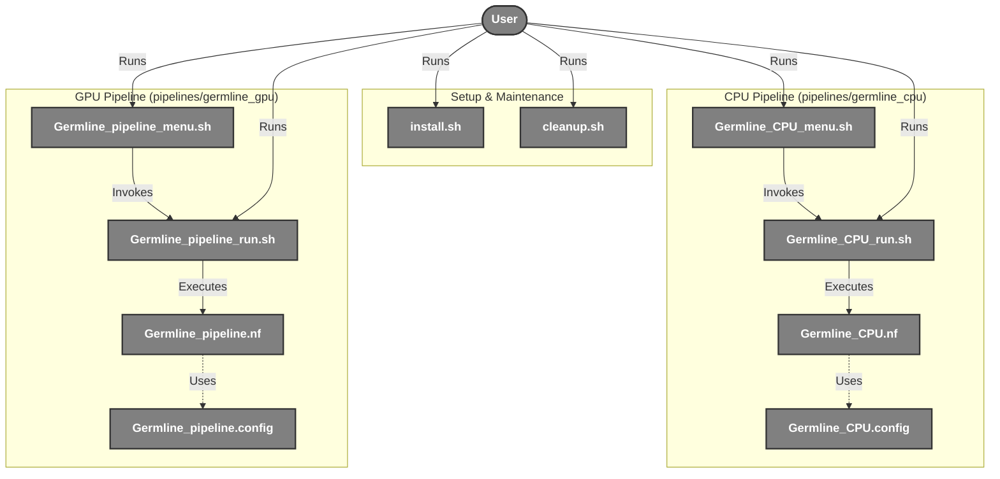
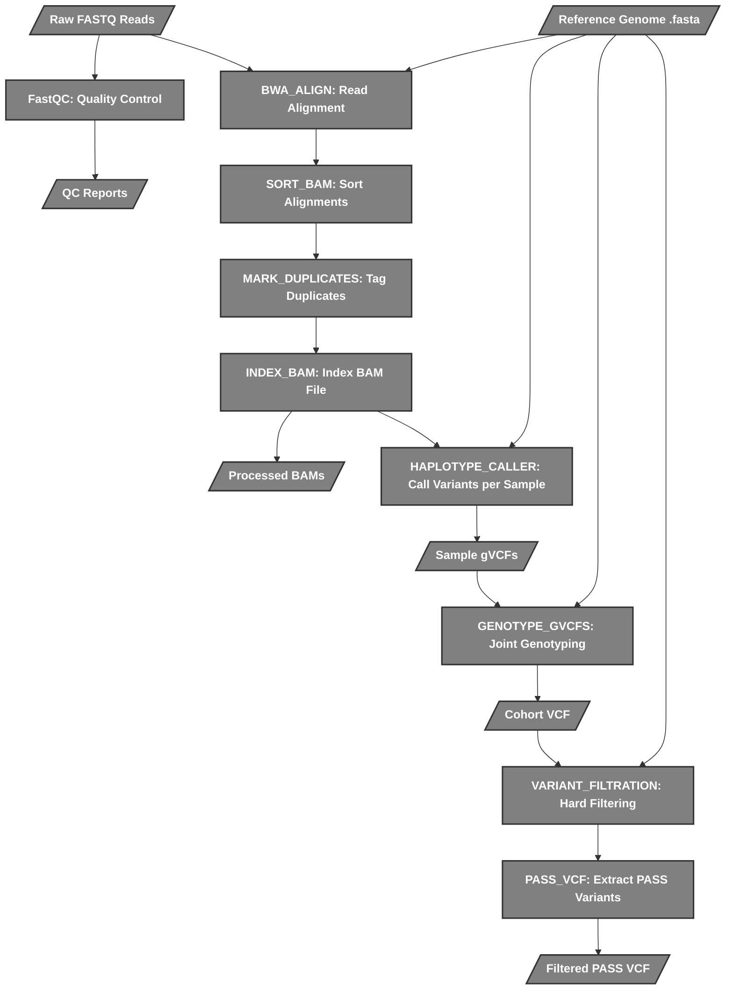
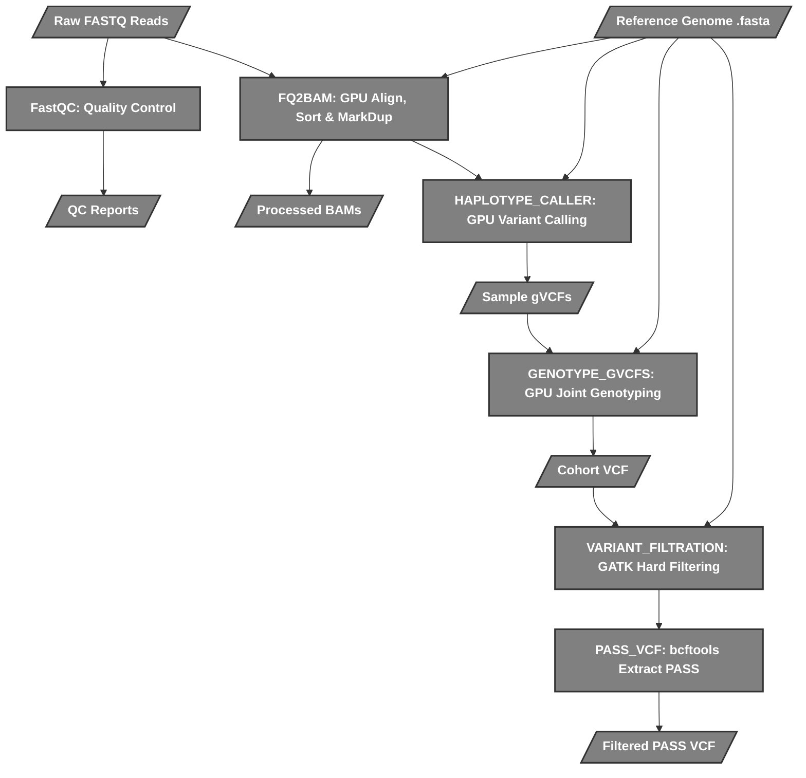

# Nextflow Germline Variant Calling Pipeline

This project provides a containerized, Nextflow-based bioinformatics pipeline for **Germline Variant Calling**. It is designed to take raw paired-end FASTQ reads and process them through to a filtered, high-quality cohort VCF. 

The pipeline supports two execution modes:
1. **CPU-only execution**: Utilizes standard open-source tools (BWA, GATK, FastQC, BCFtools).
2. **GPU-accelerated execution**: Utilizes NVIDIA Clara Parabricks for significantly faster processing.

All dependencies are containerized via Docker, ensuring reproducibility and easy deployment.

---

## 🗺️ System Map & Script Interactions

The following map illustrates how the various shell scripts and Nextflow scripts interact with one another across the project.



## 📁 Project Structure

```text
Nextflow/
├── README.md                 # Project documentation
├── install.sh                # Installation script
├── cleanup.sh                # Cleanup utility script
├── Data/                     # Default data directory
│   ├── Raw/                  # FastQ files go here
│   └── Ref/                  # Reference genomes go here
├── interface/                # Graphical & Terminal Interfaces
│   ├── gui.py                # PySide6 Desktop GUI
│   ├── main_menu.sh          # Terminal Wizard interface
│   └── requirements.txt      # GUI Python dependencies
├── pipelines/                
│   ├── germline_cpu/         # CPU-only (BWA/GATK) pipeline scripts
│   │   ├── Germline_CPU.config
│   │   ├── Germline_CPU.nf
│   │   ├── Germline_CPU_menu.sh
│   │   ├── Germline_CPU_reference_builder.sh
│   │   └── Germline_CPU_run.sh
│   └── germline_gpu/         # GPU-accelerated (Parabricks) pipeline scripts
│       ├── Germline_pipeline.config
│       ├── Germline_pipeline.nf
│       ├── Germline_pipeline_menu.sh
│       └── Germline_pipeline_run.sh
├── results/                  # Pipeline outputs (BAMs, VCFs)
└── work/                     # Nextflow intermediate working directory
```

### Script Directory

- **`install.sh`**: Global installation script. Creates required directories (`Data/`, `results/`, `work/`, `logs/`), makes scripts executable, and pulls required Docker container images.
- **`cleanup.sh`**: Maintenance utility to remove old Nextflow work directories, cached data, old logs, and dangling Docker images.
- **`Germline_CPU_run.sh` / `Germline_pipeline_run.sh`**: The core launcher scripts. They validate inputs (FASTQ, reference directories), index references if necessary (CPU only), calculate optimal CPU and memory limits dynamically based on the host system, map the correct Docker volume mounts, and execute the respective Nextflow `.nf` file.
- **`Germline_CPU.nf` / `Germline_pipeline.nf`**: The Nextflow DSL2 workflows orchestrating the bioinformatics tools.

---

## ⚙️ Pipeline Flowcharts

These flowcharts break down exactly what each Nextflow script (`.nf`) does under the hood to process the bioinformatics pipeline.

### 1. CPU Pipeline (`Germline_CPU.nf`)
This pipeline relies on traditional CPU tools: **FastQC**, **BWA**, and **GATK 4**.



### 2. GPU Pipeline (`Germline_pipeline.nf`)
This pipeline utilizes **NVIDIA Clara Parabricks** to significantly accelerate standard steps (FQ2BAM replaces BWA + Sorting + MarkDuplicates).



---

## 🚀 How to Run

1. **Install dependencies**:
   ```bash
   ./install.sh
   ```
2. **Execute a Pipeline**:
   Navigate to the respective pipeline directory and execute the run script:
   ```bash
   # CPU Pipeline
   cd pipelines/germline_cpu
   ./Germline_CPU_run.sh <cohort_name> <path_to_fastqs>

   # GPU Pipeline
   cd pipelines/germline_gpu
   ./Germline_pipeline_run.sh <cohort_name> <path_to_fastqs>
   ```
   *(Ensure `REF_DIR` and `RESULTS_DIR` environment variables are set or use the interactive menu scripts).*

3. **Cleanup**:
   ```bash
   ./cleanup.sh
   ```
