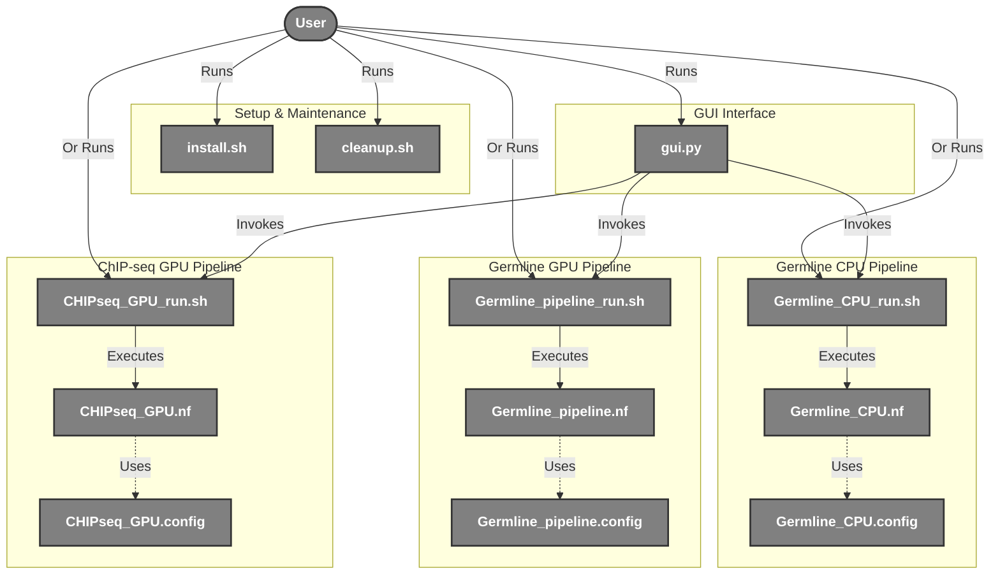
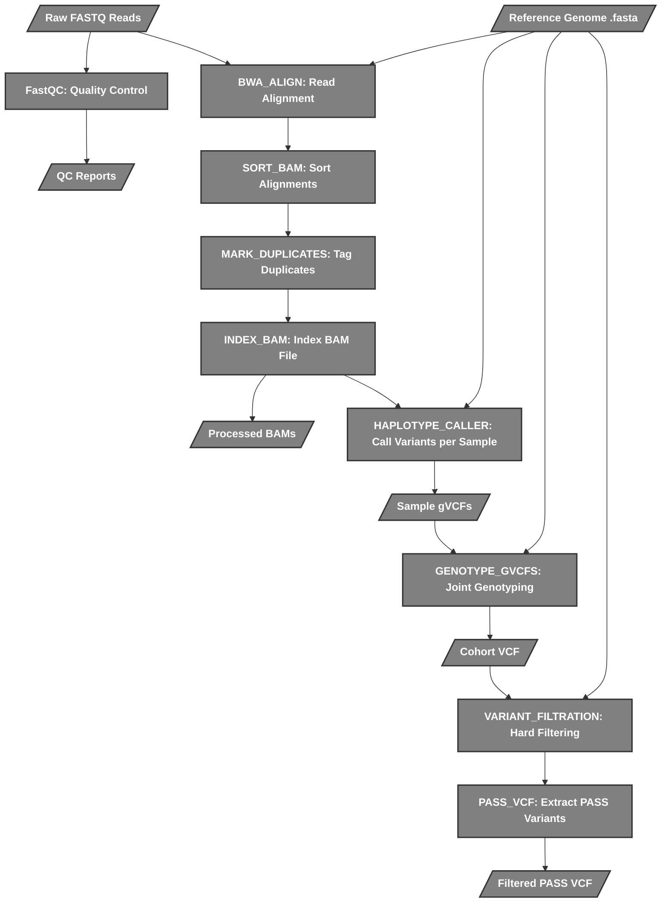
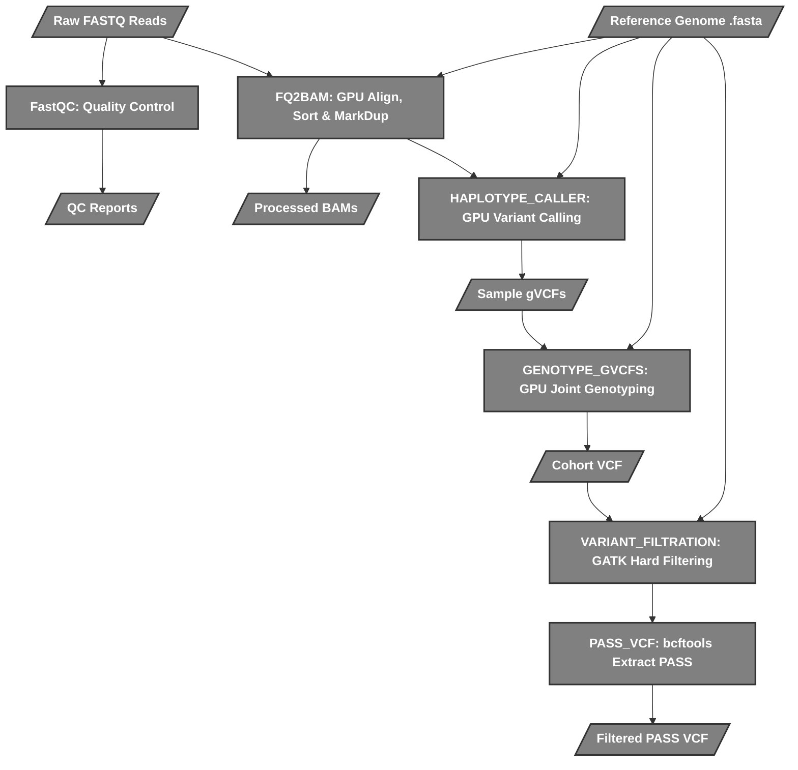
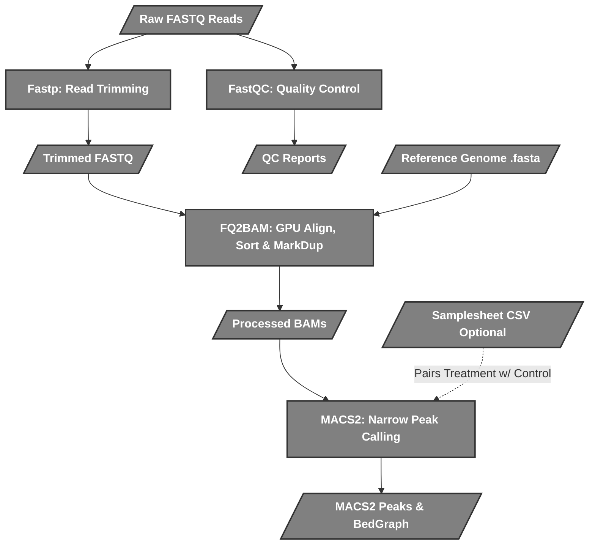

# Nextflow Genomics Suite

**Project made in BRIC-CDFD under the guidance of Dr. Akash Ranjan in the Laboratory of Computational & Functional Genomics.**
This repository contains an end-to-end framework for Next-Generation Sequencing data analysis, featuring both **Germline Variant Calling** and **ChIP-seq Peak Calling** pipelines. It provides **GPU-accelerated** options (via NVIDIA Parabricks) and equivalent **CPU-based** fallbacks (via BWA, GATK4, MACS2). 

Pipelines:
1. **Germline GPU**: FastQC → fastp → Parabricks fq2bam → Parabricks DeepVariant (or HaplotypeCaller) -> Joint Genotyping -> Variant Filtration.
2. **Germline CPU**: FastQC → fastp → BWA mem → GATK MarkDuplicates → HaplotypeCaller -> CombineGVCFs -> Joint Genotyping -> Variant Filtration.
3. **ChIP-seq GPU**: FastQC → fastp → Parabricks fq2bam → MACS2.
4. **ChIP-seq CPU**: FastQC → fastp → BWA mem → GATK MarkDuplicates → MACS2.

---

## 🖥️ Graphical User Interface (GUI)

The primary way to interact with the pipelines is through the modern PySide6 desktop application (`interface/gui.py`). 

### Features
- **Antigravity Fluid UI**: A custom-engineered, premium PySide6 graphics engine that renders an interactive, 2000-step mesh gradient ("aurora borealis") animation that reacts to your mouse in real-time with an iPhone-style frosted glass effect.
- **Independent Tabs**: Each pipeline (Germline CPU, Germline GPU, ChIP-seq GPU, ChIP-seq CPU) has a dedicated, isolated tab.
- **Auto-Open Results**: Upon successful pipeline completion, the GUI prompts you to automatically pop open the native file explorer to exactly where your BAMs, VCFs, and QC reports were saved.
- **Descriptive Error Popups**: The GUI actively parses the Nextflow backend logs. If a failure occurs (e.g., Docker disconnected, out of memory, no space left, missing indices), it presents a clear, actionable popup window explaining exactly how to fix the issue instead of a raw exit code.
- **Resource Monitor & Clamping**: A detached pop-up window tracks live CPU/RAM usage. All underlying shell scripts dynamically "clamp" max thread and RAM usage based on your actual system hardware to prevent Out of Memory (OOM) crashes across different devices.
- **Low Memory Mode**: A built-in toggle for NVIDIA Parabricks pipelines to support GPUs with `<12GB VRAM`.
- **Pre-built Indexing**: 1-click BWA reference index building directly from the GUI.

To run the GUI:
```bash
python interface/gui.py
```

---

## 📂 Input Requirements

To successfully run any of the pipelines, you must provide the following inputs in specific formats:

### 1. FASTQ Files
- **Format**: Reads must be **paired-end** and **gzipped** (`.fastq.gz`).
- **Naming Convention**: Files must be named strictly matching `*_R1.fastq.gz` and `*_R2.fastq.gz`, where the prefix before `_R1` or `_R2` exactly matches the sample's name.
  - *Correct*: `sampleA_R1.fastq.gz`, `sampleA_R2.fastq.gz`
  - *Incorrect*: `sampleA_1.fq.gz`, `sampleA_R1_001.fastq.gz` (rename these to the required format).
- **Directory**: Place all your raw reads in a single directory to be selected in the GUI or CLI.

### 2. Reference Genome
- **Format**: You must provide a reference genome in FASTA format (`.fa` or `.fasta`).
- **Indices**: The pipelines require multiple reference indices (e.g., BWA `.bwt`, Samtools `.fai`, GATK `.dict`). 
  - If these are missing, the pipeline will automatically attempt to build them using Docker before running.
  - **Tip**: Building indices can take a long time. It is highly recommended to use the "Build Reference Index" button in the GUI once per new reference genome.

### 3. Samplesheet (ChIP-seq Only)
- **Format**: A comma-separated values (`.csv`) file named `samplesheet.csv`.
- **Purpose**: Required only if you want to map treatment samples against specific control/Input samples for `MACS2` peak calling.
- **Structure**: Must contain a header with exactly `sample,fastq_1,fastq_2,control`.
  - Example:
    ```csv
    sample,fastq_1,fastq_2,control
    treat_1,treat_1_R1.fastq.gz,treat_1_R2.fastq.gz,input_1
    input_1,input_1_R1.fastq.gz,input_1_R2.fastq.gz,
    ```
- **Note**: If no samplesheet is provided, the ChIP-seq pipeline will default to running peak calling without a matched control.

---

## 🗺️ System Map & Script Interactions



## 📁 Project Structure

```text
Nextflow/
├── README.md                 # Project documentation
├── install.sh                # Installation script
├── cleanup.sh                # Cleanup utility script
├── Data/                     # Default data directory
│   ├── Raw/                  # FastQ files go here
│   └── Ref/                  # Reference genomes go here
├── interface/                # Graphical Interfaces
│   ├── gui.py                # PySide6 Desktop GUI
│   └── requirements.txt      # GUI Python dependencies
├── pipelines/                
│   ├── germline_cpu/         # CPU-only (BWA/GATK) pipeline scripts
│   ├── germline_gpu/         # GPU-accelerated (Parabricks) variant calling
│   └── chipseq/              # GPU-accelerated ChIP-seq peak calling
├── results/                  # Pipeline outputs (BAMs, VCFs, Peaks)
└── work/                     # Nextflow intermediate working directory
```

### Detailed Script Lifecycle

When you trigger a pipeline run, the scripts interact in a specific, layered sequence to move from a graphical button click down to a containerized GPU process:

1. **The Interface Layer (`gui.py`)**
   - **Role:** Captures user inputs (paths, names) and translates graphical slider values into strict environment variables (e.g., `MAX_CPUS`, `MAX_MEM_GB`, `LOW_MEMORY`).
   - **Action:** Spawns a background subprocess that executes the bash runner script for the selected pipeline.

2. **The Runner Layer (`*_run.sh`)**
   - **Role:** The bridge between your host operating system and Nextflow/Docker.
   - **Action:** 
     - Parses the environment variables passed down by the GUI.
     - Calculates dynamic resource allocations (e.g., preventing FastQC from requesting more memory than available).
     - Constructs the `docker run` command, explicitly mapping (`-v`) your Windows directories to Linux directories inside the container.
     - Kicks off the Nextflow executable.

3. **The Orchestrator Layer (`*.nf` & `*.config`)**
   - **Role:** Nextflow's domain. The `.nf` file defines the pipeline logic, and the `.config` defines the default resource profiles.
   - **Action:** Nextflow reads the `.nf` file to understand the dependency graph (e.g., "FASTP must finish before FQ2BAM starts"). It dynamically creates isolated, hashed `work/` directories for every single process to prevent data collisions.

4. **The Execution Layer (Inside the Containers)**
   - **Role:** The actual bioinformatics tools (Parabricks, BWA, GATK).
   - **Action:** Nextflow mounts the specific `work/` directory into an isolated Docker container. Tools like `fq2bam` execute directly on your GPU inside the container, read the files, output a BAM, and exit. Nextflow detects the exit code, flags it as a success (✔), and eventually moves the final data to the `results/` folder.

---

## ⚙️ Pipeline Flowcharts

These flowcharts break down exactly what each Nextflow script (`.nf`) does under the hood.

### 1. Germline CPU Pipeline (`Germline_CPU.nf`)
Utilizes traditional CPU tools: **FastQC**, **BWA**, and **GATK 4**.



### 2. Germline GPU Pipeline (`Germline_pipeline.nf`)
Utilizes **NVIDIA Clara Parabricks** to significantly accelerate standard steps.



### 3. ChIP-seq GPU Pipeline (`CHIPseq_GPU.nf`)
Utilizes **Fastp** for trimming, **NVIDIA Parabricks fq2bam** for alignment, and **MACS2** for peak calling. Supports Input DNA controls via a `samplesheet.csv`.



---

## 🚀 How to Run Manually (Without GUI)

If you prefer the terminal, you can execute the runner scripts directly.
1. **Install dependencies**:
   ```bash
   ./install.sh
   ```
2. **Execute a Pipeline**:
   ```bash
   export REF_DIR="/path/to/reference"
   export RESULTS_DIR="/path/to/results"
   
   # Germline CPU
   bash pipelines/germline_cpu/Germline_CPU_run.sh <cohort_name> <path_to_fastqs>

   # Germline GPU
   bash pipelines/germline_gpu/Germline_pipeline_run.sh <cohort_name> <path_to_fastqs>
   
   # ChIP-seq GPU
   bash pipelines/chipseq/CHIPseq_GPU_run.sh <project_name> <path_to_fastqs> <path_to_samplesheet_optional>
   ```

3. **Cleanup**:
   ```bash
   ./cleanup.sh
   ```

## 🐋 Singularity / HPC Mode (Docker-less)
If you are running on an Enterprise cluster or a Linux system where Docker is not available, you can use the interactive Singularity wrapper. This completely bypasses Docker and runs Nextflow and the Parabricks `.sif` containers natively.

```bash
# Make the wrapper executable
chmod +x run_singularity.sh

# Run the interactive wrapper
./run_singularity.sh
```
The script will automatically check for Singularity, download Nextflow if missing, and ask you which pipeline you'd like to run.
